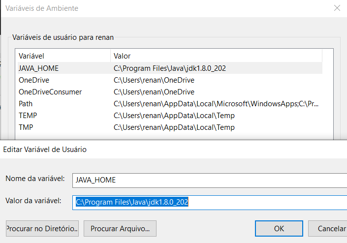
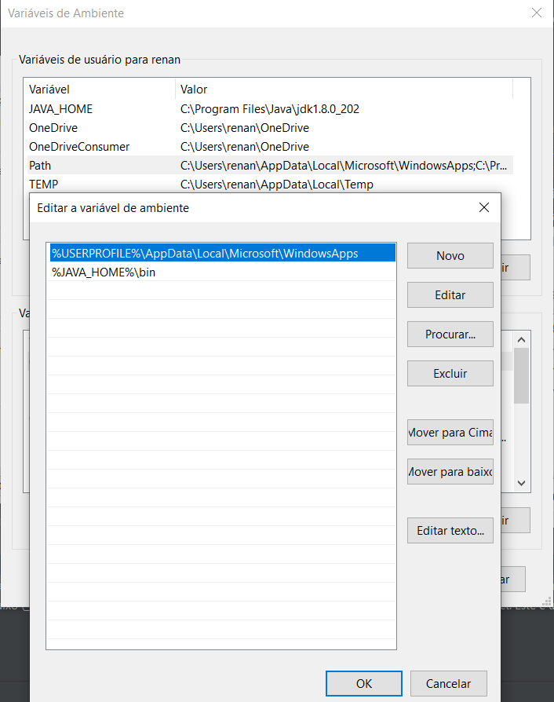
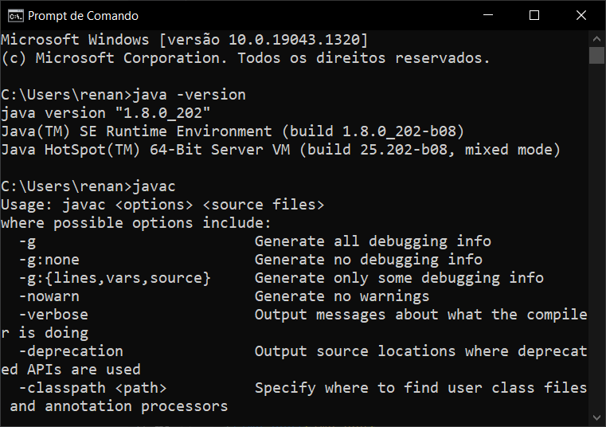
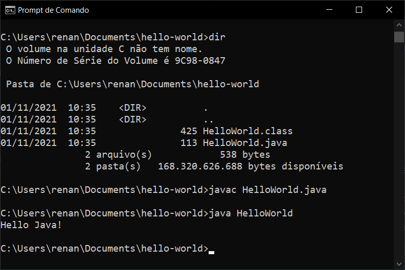

# Primeiros Passos em Java
## adicionar link da playlist do youtube

## 📌 Java?!
 - [Java](https://www.oracle.com/br/java/) é a principal linguagem de programação e plataforma de desenvolvimento
 - É uma linguagem de programação orientada a objetos
 - Simples e robusta
 - Oriunda do C/C++
 - Linguagem de alto desempenho
 - Multiplataforma
 - Linguagem compilada

## 📌 Instalação e Configuração do Java
- Primeiro precisamos baixar o arquivo de instalação da JDK 8 (ou outra versão posterior)
  - https://www.oracle.com/java/technologies/javase/javase8-archive-downloads.html
- A instalação é simples, basta apenas ir avançando com a instalação
- Após a instalação precisamos configurar as variáveis de ambiente do windows.
  - Vá até às **Variáveis de Ambiente do Windows** e vamos adicionar a variável **JAVA_HOME**:  
  - 
  - A variável **JAVA_HOME** deve apontar para o caminho base da instalação do Java.
  - Agora precisamos adicionar a variável **JAVA_HOME** ao **Path** do windows, para isso vamos editar a variável **Path**
  - 
  - Adicionar da forma como mostra na imagem **%JAVA_HOME%\bin**
  - Após estás configurações, basta clicarmos em **Ok** na tela principal das Variáveis de Ambiente.
- Agora podemos abrir o **Prompt de Comando** do Windows para validar a nossa configuração
  - No prompt vamos digitar dois comandos:
    - 1: `java -version`
    - 2: `javac`
  - E o retorno esperado é este:
  - 

## 📌 Escrevendo nosso primeiro Hello World em Java
- Crie um arquivo chamado `HelloWorld.java` e salve o arquivo em um diretório de sua preferência
- Adicione ao arquivo o conteúdo abaixo

~~~java
  public class HelloWorld {
    public static void main(String[] args) {
        System.out.println("Hello Java");
    }
}
~~~
- Abra o prompt de comando do windows e navegue até o diretório onde se encontra o arquivo que acabamos de criar
- Para executar nosso arquivo, primeiro precisaremos compilar nosso código, Java é uma linguagem de programação compilada, diferente de outras linguagens que são apenas interpretadas.
- Para compilar vamos utilizar o comando `javac` e para executar o comando `java`
- Comandos:
  - 1: `javac HelloWord.java` para compilar o nosso código. Se der tudo certo, nenhuma mensagem será retornada, agora nosso compilador criou um arquivo chamado HelloWorld.class
  - 2: `java HelloWorld` para executar nosso código. Veja que não é necessário colocar o extensão `.class` para executar a nossa aplicação
  

## 📌 Variáveis em Java
- As variáveis são posições na memória que podem armazenar dados.
- Abaixo temos as principais variáveis de tipo primitivo 
~~~java
public class HelloWorld {
    public static void main(String[] args) {
      byte vByte = 127; //8bits de -128 ate 127      
      short vShort = 32767; //16bits -32.768 ate 32.767
      int vInt = 2147483647; //32bits -2.147.483.648 ate 2.147.483.647
      long vLong = 9223372036854775807L; //64bits -9.223.372.036.854.775.808L e -9.223.372.036.854.775.807L
      
      char vChar = 'C';
      
      float vFloat = 2.6f; //32bits até 7 digitos
      double vDouble = 3.59; //64bits ate 15 digitos
      
      boolean tipoBooleano = true; // true ou false        
    }
}
~~~
## 📌 Inserindo comentários no nosso código
- No código acima podemos notar que uma parte dele ficou cinza, este código está comentado
- Quando o código está comentado o compilador não considera este código, seja ele um código realmente ou alguma frase
- Veja no código abaixo que podemos realizar os comentários em qualquer parte do nosso código e também podemos comentar mais de uma linha ao mesmo tempo sem a necessidade de incluir a `//` antes da frase ou código que queremos comentar
~~~java
public class Variaveis {
  //Método responsável por executar o programa
  public static void main(String[] args) {

    //Imprime a frase Hello Java no console da aplicação
    System.out.println("Hello Java");

    /*
     Abaixo veremos os tipos mais utilizados
     de variáveis em Java.
     */

    String variavelString = "Hello Java";
    char variavelChar = 'A';

    int variavelInt = 0;
    long variavelLong = 4;

    float variavelFloat = 1.2F;
    double varialDouble = 1.2;

    //boolean variavelBooleanTrue = true;
    //boolean variavelBooleanFlase = false;
  }
}
~~~
## 📌 Deixando nosso programa mais dinâmico
- Até agora vimos que podemos declarar nossas variáveis, elas tem basicamente 3 elementos: `tipo`, `nome` e `valor`
- Mas digamos que eu quero setar um valor baseado em algo que o meu usuário digitou em algum momento
- O Java nos permite fazer isso usando a classe `Scanner`, veja o uso abaixo
~~~java
import java.util.Scanner;

public class DigiteAqui {
  public static void main(String[] args) {
    Scanner leitor = new Scanner(System.in);

    System.out.println("Digite um valor aqui:");
    int valor = leitor.nextInt();
    System.out.println("Valor digitado: " + valor);
  }
}
~~~
- A primeira coisa que podemos notar é que como estamos utilizando uma outra `Classe`, é necessário fazer o `import`, como podemos ver na primeira linha
- Para utilizar a classe `Scanner` primeiro precisamos criar uma instância da classe, e para isso precisamos utilizar o código: `Scanner leitor = new Scanner(System.in);`
- Depois para realizarmos a leitura de uma informação por parte do usuário escrevemos o código `int valor = leitor.nextInt();`, este código é responsável por receber a informação digitada pelo usuário e armazenar na variável `int valor`
- Por fim imprimimos no console da aplicação o valor digitado pelo usuário
- Provavelmente esse código deve ter elementos ainda não conhecidos, mas não entraremos em detalhes no momento, a ideia por enquanto é entender como capturar algo do usuário

## 📌 Principais operadores
- Até agora mesmo sem saber já estamos utilizando pelo menos um operador, que é o `=`, conhecido por ser um operador de atribuição.
- Quando queremos atribuir um valor a uma variável utilizamos o `=`
- Exemplo de uso do operador de atribuição que já realizamos até aqui:
~~~java
public class DigiteAqui {
  public static void main(String[] args) {
    boolean condicao = true;
    String frase = "Hello Java";    
    int valor = leitor.nextInt();    
  }
}
~~~
- Outro operador já visto foi o `+`, até agora utilizamos ele para realizar concatenações, como no exemplo abaixo, onde eu quero printar na tela uma mensagem + o conteúdo de uma variável, porém o `+` também serve para realizar operações aritméticas.
~~~java
public class DigiteAqui {
  public static void main(String[] args) {    
    String frase = "Java";    
    //vai printar no console da aplicação a frase 'Hello Java'
    System.out.println("Hello " + frase);  
    
    int valor1 = 10;
    int valor2 = 10;    
    //Neste caso vai realizar a soma das duas variáveis inteiras     
    System.out.println(valor1 + valor2);
  }
}
~~~
- **Abaixo vamos ver os principais operadores**

| Operador | Descrição |
| :---: | --- |
| == | Igualdade |
| =  | Atribuição |
| != | Diferente |
|  <, <=, >, >= |  Menor, menor ou igual, maior e maior ou igual |
| && | Operador E (and) |
|  &#124;&#124; | Operador Ou (or) |
| !  | Operador de negação |
| *  | Multiplicação |
| /  | Divisão |
| +  | Soma ou Concatenação quando envolve uma string |
| -  | Subtração |

## 📌 Estrutura condicional (if else)
- A sintaxe básica para realizar uma operação de ramificação, mais conhecida como `if else` é esta:
~~~java
public class DigiteAqui {
  public static void main(String[] args) {
    boolean condicao = true;
    
    if (condicao == true) {
      System.out.println("Condição verdadeira");
    } else {
      System.out.println("Condição falsa");
    }    
  }
}
~~~
- Primeiro declaramos uma variável do tipo `booleana` com a condição `true`
- Depois dentro dos parênteses do `if (condicao == true)` testamos se a variável `condicao` é `true`, se sim, o seguinte código é executado: `System.out.println("Condição verdadeira");` e em seguida a aplicação finaliza. Neste caso o código contido dentro do `else` não será executado.
- Abaixo vamos ver outros exemplos de declaração de `if else`
~~~java
public class DigiteAqui {
  public static void main(String[] args) {
    boolean condicao = true;
    
    // utilização padrão if + else
    if (condicao == true) {
      System.out.println("Condição verdadeira");
    } else {
      System.out.println("Condição falsa");
    }

    // outra forma de utilizar, apenas com o if
    // neste exemplo caso a condição fosse false nada aconteceria
    if (condicao == true) {
      System.out.println("Condição verdadeira");
    }

    /*
     * Aqui temos um exemplo maior:
     * 1. testamos se valor == 0, se for verdade escreveremos no console 'O valor é zero'
     * 2. caso o valor não seja 0, testaremos novamente se o valor é maior que zero
     * 3. caso o valor não seja 0 ou > 0, então nos resta dizer 'O valor é menor que zero'
     */
    int valor = 0;
    if (valor == 0) {
      System.out.println("O valor é zero");
    } else if (valor > 0) {
      System.out.println("O valor é maior que zero");
    } else {
      System.out.println("O valor é menor que zero");
    }
  }
}
~~~

## 📌 Estrutura condicional (switch)
- A estrutura `switch` tem o uso semelhante ao `if-else-if`
- Podemos utilizar apenas os tipos `byte`, `short`, `int`, `long`, `enum` e `String`
- A declaração do switch testa a igualdade de uma variável mediante múltiplos valores
~~~java
public class CondicaoSwitch {
    public static void main(String[] args) {
        int dia = 4;
        switch (dia) {
            case 1:
                System.out.println("segunda");
                break;
            case 2:
                System.out.println("terça");
                break;
            case 3:
                System.out.println("quarta");
                break;
            case 4:
                System.out.println("quinta");
                break;
            case 5:
                System.out.println("sexta");
                break;
            case 6:
                System.out.println("sábado");
                break;
            default:
                System.out.println("domingo");
        }
    }
}
~~~
- Pode ter 1 ou mais valores `case` para um `switch`
- O tipo de dado do case deve ser o mesmo declarado na expressão switch
- A declaração do `default` é opcional
- A declaração do `break` é opcional, quando o programa chega no `break` ele termina a execução do switch, caso o `break` não exista, o conteúdo do próximo case abaixo será executado

## 📌 Estrutura de repetição (for)
- A estrutura de repetição é utilizada para que uma parte do código possa ser repetida inúmeras vezes
- Abaixo temos um exemplo simples do uso da estrutura de repetição chamada `for` 
~~~java
public class RepeticaoFor {
    public static void main(String[] args) {
        for(int i = 1; i <= 10; i++) {
            System.out.println("Valor: " + i);
        }
    }
}
~~~
- A estrutura do for: `for(int i = 1; i <= 10; i++)` contém 3 expressões
- 1 - `int i = 1;` Este bloco é executado uma única vez, aqui declaramos a variável `i` com o valor 1
- 2 - `i <= 10;` Este bloco é executado até que ele seja false. Enquanto `i` for menor ou igual a 10 este bloco é executado
- 3 - `i++` Este bloco é executado toda vez que o bloco 2 for executado. Toda vez que for executado ele incrementa 1 ao conteúdo de `i`, usamos o `i++`, mas poderia ser `i+=1` ou ainda `i=i+1`
- Esta estrutura de repetição é recomendável utilizar quando sabemos o número de vezes que precisamos repetir o bloco de código 

## 📌 Estrutura de repetição (while)
- `While` é outra estrutura de repetição que pode ser uma alternativa ao `for`
- Podemos utilizar quando não sabemos a quantidade de vezes que o laço deve ser repetir
- `while` significa enquanto em português, portanto, enquanto a condição for verdadeira repete o conteúdo do laço
~~~java
public class RepeticaoWhile {
    public static void main(String[] args) {
        int valor = 1;
        while(valor <= 10) {
            System.out.println(valor);
            valor++;
        }
    }
}
~~~
- Se a condição do `while` `(valor <= 10)` for verdadeira, o conteúdo do while será executado, e enquanto a condição for verdadeira continuará sendo executado o conteúdo do while
- Neste caso enquanto a variável `valor` for menor ou igual a 10, o conteúdo do while segue sendo executado. Veja que dentro do while estamos incrementando o valor da variável `valor`, caso não o fizéssemos entraríamos em um loop infinito, pois a condição seria sempre verdadeira, precisamos tomar cuidado quando utilizamos esta estrutura de repetição 

## 📌 Estrutura de repetição (do while)
- `Do While` é uma estrutura de repetição bem parecida com o `While`
- Assim como o `While` podemos utilizar quando não sabemos a quantidade de vezes que o laço deve se repetir, mas sabemos que ele deve ocorrer ao menos uma vez
- Diferente do `While` que a condição é realizada antes de entrar no laço de repetição, no `Do While` o nosso código será executado ao menos uma vez mesmo que a condição seja false, pois o teste da condição acontece ao final do código do `Do While`
~~~java
public class RepeticaoDoWhile {
  public static void main(String[] args) {
    int valor = 1;
    do {
      System.out.println(valor);
      valor++;
    } while (valor <= 10);
  }
}
~~~
- O código do laço do `Do While` vai executar ao menos uma vez, e continuará a executar mais vezes enquanto a condição `while (valor <= 10)` for verdadeira
- Assim como no `While` temos que tomar cuidado para que o nosso `Do While` não entre em loop infinito

## 📌 paneladev.arrays.Arrays and For-Each Loop
- `paneladev.arrays.Arrays` são usados para armazenar informações de um mesmo tipo de dado
- O tamanho de um `array` é fixo, e é estabelecido quando criado
- Cada item do `array` é chamado de elemento, e o acesso ao elemento se dá pelo índice do array
- Imagine um array de números inteiros de tamanho 5 

|||||||
|---|---|---|---|---|---|
|Elementos => |35|**22**|15|18|60|
|Indices => |0|**1**|2|3|4|

- Para ter acesso ao elemento de número `22` eu preciso pegar o índice de número `1`
- Os elementos são sempre indexados a partir de zero
~~~java
public class Arrays {
    public static void main(String[] args) {
        int array1[] = {15,17,19,21,23};
        int[] array2 = new int[10];

        String[] array3 = {"Ford", "Fiat"};
        String array4[] = new String[5];
    }
}
~~~
- As duas formas de instanciar um array estão corretas: `int[] array` ou `int array[]`
- Neste caso estamos iniciando um array já populado com 5 posições `int array1[] = {15,17,19,21,23};`
- E neste estamos dizendo que nosso array tem 10 posições, mas não definimos os valores `int[] array2 = new int[10];`, como este array se trata de um array de `int` que é um tipo primitivo, todos os elementos do array são por default `0`
- Quando declaramos um array de um tipo não é possível armazenar um tipo diferente de dado
- `paneladev.arrays.Arrays` são um objeto em Java
- Cada array sabe seu próprio tamanho, para isso podemos acessar o método `length` do `array`.
- Olhando o nosso código acima, o retorno deste código `array3.length` seria 2, pois inicializamos o array já com dois valores

### ✔️Como podemos acessar os valores dos nossos arrays?
- Um pouco acima falamos sobre as estruturas de repetição, vamos utilizar o `for` para percorrer todos os indices de um array e imprimi-los
- Exemplo utilizando a estrutura de repetição `for`
~~~java
public class Arrays {
    public static void main(String[] args) {
        int[] valores = {15,17,19,21,23};

        System.out.println("Tamanho do array: " + valores.length);

        for(int i = 0; i < valores.length; i++) {
            System.out.println("Elemento do índice " + i + " :" + valores[i]);
        }
    }
}
~~~

- Exemplo utilizando a estrutura de repetição `while`
~~~java
public class Arrays {
    public static void main(String[] args) {
        int[] valores = {15, 17, 19, 21, 23};

        System.out.println("Tamanho do array: " + valores.length);

        int controle = 0;
        while(controle < valores.length) {
            System.out.println("Elemento do índice " + controle + " :" + valores[controle]);
            controle++;
        }
    }
}
~~~

- Exemplo utilizando a estrutura de repetição `do while`
~~~java
public class Arrays {
    public static void main(String[] args) {
        int[] valores = {15, 17, 19, 21, 23};

        System.out.println("Tamanho do array: " + valores.length);

        int controle = 0;
        do {
            System.out.println("Elemento do índice " + controle + " :" + valores[controle]);
            controle++;
        } while (controle < valores.length);

    }
}
~~~
- Vimos que é possível acessar os dados do array utilizando as 3 estruturas de repetição, mas a mais indicada para este caso seria o `for` pois sabemos a quantidade de vezes que precisamos percorrer, através do método `length` do array

### ✔️For-each Loop
- Além do `for` que já vimos, existe outro for chamado de `For-each Loop` que facilita a maneira como escrevemos o nosso código
~~~java
public class Arrays {
    public static void main(String[] args) {
        int[] valores = {15, 17, 19, 21, 23};

        System.out.println("Tamanho do array: " + valores.length);

        for(int var : valores) {
            System.out.println("Valor: " + var);
        }
    }
}
~~~ 
- O `For-each loop` facilita bastante a escrita do nosso `for`, com este `for` não precisamos ter uma variável de controle e nem incrementa-la
- `for(int var : valores)` a esquerda dos `:` precisamos declarar uma variável do mesmo tipo dos dados do array e a direita apenas declaramos o nosso array. A cada loop do for a variável `var` recebe o valor do elemento do array, neste código não temos necessidade de lidar com o índice, esse for-each já lida com isso pra gente

## 📌 Métodos em Java
- Os métodos são instruções de código que executam uma determinada tarefa e retornam ou não uma informação para quem os invocou
~~~java
public class Metodos {

    public static void main(String[] args) {
        int soma = somaValores(10, 10);
        System.out.println("Somatorio: " + soma);

        imprimiMsg("Hello Java");
    }

    public static void imprimiMsg(String mensagem) {
        System.out.println(mensagem);
    }

    public static int somaValores(int val1, int val2) {
        return val1 + val2;
    }
}
~~~
- Até agora trabalhamos com a criação de uma classe e dentro dela sempre criamos um método apenas chamado `main`, sabemos que este método é específico para quando queremos que nossa aplicação execute
- Agora adicionamos dois métodos novos na nossa classe, um método responsável por realizar a soma de dois valores e outro responsável por imprimir uma mensagem no console
- O método `void imprimiMsg(String mensagem)` não retorna nenhuma informação para quem o chama, por isso a palavra `void` na assinatura do método, e ele recebe um valor do tipo `String` que demos o nome de `mensagem` e depois a sua responsabilidade é imprimir essa variável no console
- Já o método `int somaValores(int val1, int val2)` ele retorna um tipo `int`, recebe duas variáveis do tipo `int`, `val1` e `val2`, como ele retorna um valor precisamos utilizar a palavra `return`. A responsabilidade do método é realizar a soma das duas variáveis que ele recebe e retornar o resultado para quem o invocou